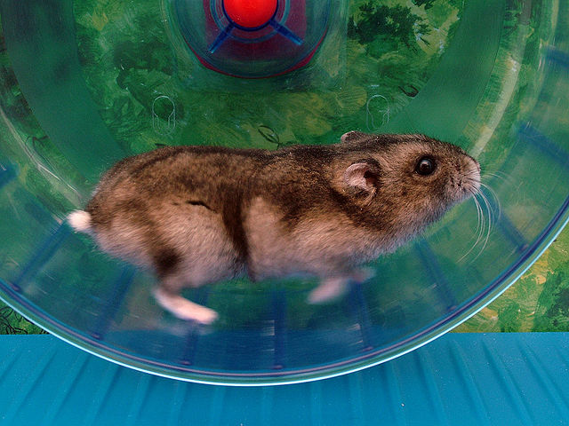

# Tournette

Tournette: Gopher Wheel in Ancien French




This is (yet another) simple utility to rebuild/reload your Go program when source changes.

## Features:

 * Simple, only one binary, no configuration file
 * Very simple, only one source file, change as you want
 * Flexible, not litmited to standard go commands

### Installation:

```
go get github.com/juju2013/tournette
```

### Simple usage:

```
cd your_project_path
tournette
```

This will compile your project by using `go build .` and then launch the result binary if successful.

Any change in your source will stop the current program, compile it and relaunch it again.

### Advanced usage:

```
cd $HOME/projects/apolloXI/build
TOURNETTE_REGEX="^.*\.(go|py)$" \
TOURNETTE_BUILDCMD=./build.sh
TOURNETTE_RUNCMD=/tmp/test/my_launcher.sh \
TOURNETTE_DIR=$HOME/projects/apolloXI/src \
tournette \
-all -these options -go -to your_program
```

That means: any go or python source change in `$HOME/projects/apolloXI/src` will trigger `$HOME/projects/apolloXI/build/build.sh` to compile 
and then launch `/tmp/test/my_launcher.sh`,
with `-all -these options -go -to your_program` as arguments.

## Copyright

Copyright (C) 2019 by juju2013@github, under BSD license (see LICENSE file),
image credit: [Doenertier82](https://en.wikipedia.org/wiki/File:Phodopus_sungorus_-_Hamsterkraftwerk.jpg)
